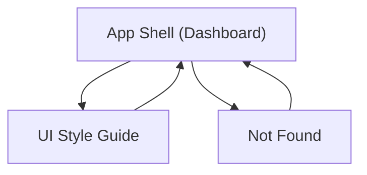

## 1. Product Overview

Trackify Frontend is the initial UI foundation for a work/pay tracking SaaS.
It provides a reusable app shell (sidebar layout) and a monochrome design system for future features.

## 2. Core Features

### 2.1 Feature Module

Our frontend foundation requirements consist of the following main pages:

1. **App Shell (Dashboard)**: base sidebar layout, header, content area, placeholder dashboard content.
2. **UI Style Guide**: monochrome theme tokens, component previews, usage guidance.
3. **Not Found**: friendly 404 page with a way back to the app.

### 2.3 Page Details

| Page Name             | Module Name          | Feature description                                                                                                   |
| --------------------- | -------------------- | --------------------------------------------------------------------------------------------------------------------- |
| App Shell (Dashboard) | App layout           | Render persistent left sidebar + main content region; support active nav state; keep layout consistent across routes. |
| App Shell (Dashboard) | Sidebar navigation   | Navigate to key routes (Dashboard, Style Guide); support collapsed/expanded behavior on smaller widths.               |
| App Shell (Dashboard) | Top header           | Show current page title; reserve space for future actions (disabled placeholders only).                               |
| App Shell (Dashboard) | Content placeholder  | Display simple dashboard placeholder cards to validate spacing/typography.                                            |
| UI Style Guide        | Theme tokens         | Document and display core colors, typography scale, borders, radius, spacing, shadows (subtle).                       |
| UI Style Guide        | Component primitives | Preview base components (Button, Input, Select, Card, Table row, Badge) in default/hover/disabled states.             |
| UI Style Guide        | Layout examples      | Show example card grids and form layouts using the shared tokens.                                                     |
| Not Found             | Error state          | Show “Page not found”; provide primary action to return to Dashboard.                                                 |

## 3. Core Process

You land on the Dashboard inside the App Shell. You use the left sidebar to move between Dashboard and the Style Guide. If you open an unknown route, you see Not Found and can return to Dashboard.

