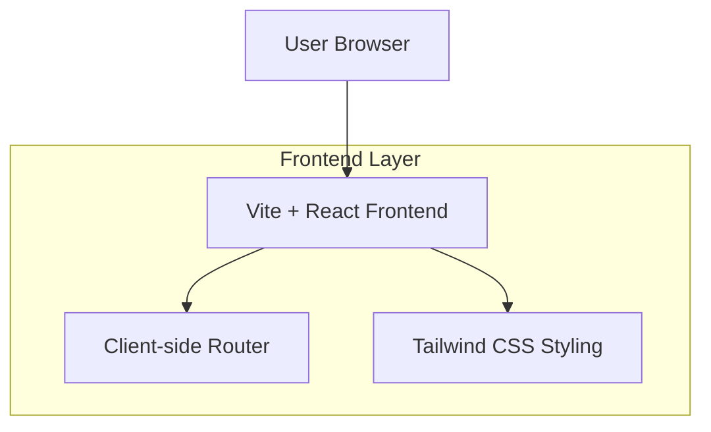

## 1.Architecture design

## 2.Technology Description
- Frontend: Vite + React@18 + tailwindcss@3
- Routing: react-router-dom (client-side)
- Backend: None (no API integration yet)

## 3.Route definitions
| Route | Purpose |
|---|---|
| / | Dashboard placeholder rendered inside the base sidebar layout |
| /styleguide | Theme tokens + component previews for the monochrome UI |
| * | Not Found page with link back to / |

## Folder structure (frontend)
- public/
  - src/
    - components/ (reusable UI primitives: Button, Card, Input…)
    - layouts/ (SidebarLayout, page shell)
    - pages/ (Dashboard, StyleGuide, NotFound)
    - services/ (empty for now; future API clients)
    - hooks/ (shared hooks)
    - utils/ (formatting, constants, theme tokens)
    - main entry (app bootstrap, router, tailwind imports)